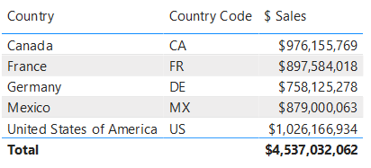
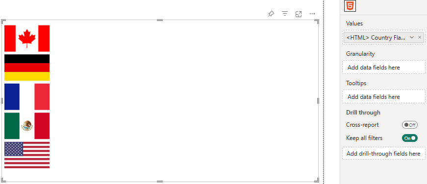
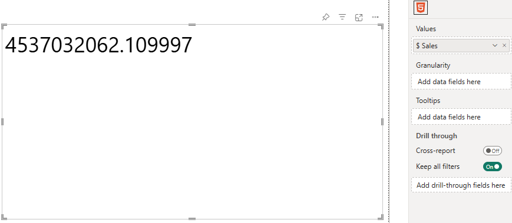
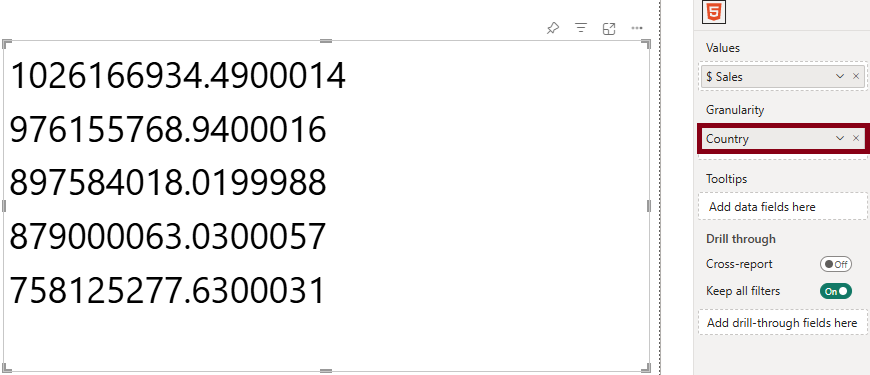
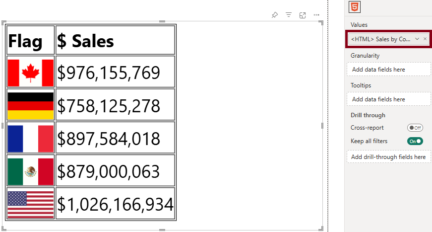
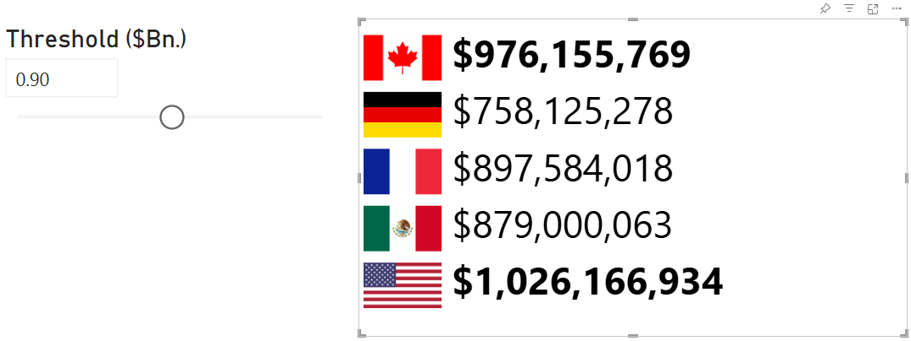
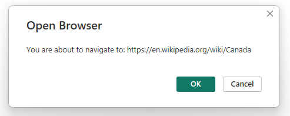

# Simple Worked Example

## Finished Product

This example is designed to show you how you can start creating simple content, and then start applying more advanced DAX. With a working knowledge of HTML and CSS, you will be able to get very creative. On this page, we'll get into the basics of creating HTML-based columns and measures.

The sample workbook is shown below and you can navigate through the pages to see our example built up step-by step. You can [download the sample workbook here](/pbix/HTML-Content-Data-Model-Walkthrough.pbix) if you want to do your own thing.

---

<div align="center">
<iframe
  width="600"
  height="373.5"
  src="https://app.powerbi.com/view?r=eyJrIjoiM2M4NjZkZjQtMTEyZC00Zjc4LWIwZTktYTU5MGI1MGEyNmI3IiwidCI6IjUzYmJlMGQ3LTU0NzItNGQ0NS04NGY0LWJiNzJiYjFjMjI4OSJ9"
  frameborder="0"
  allowFullScreen="true"
></iframe>
</div>
---

:::warning Regarding Image URLs in Our Example
For our example (and for simplicity), **we are using the [regular (uncertified) edition](visual-editions#regular) of HTML Content**. This can access image URLs by their web address, provided that they are publicly available and not subject to any cross-domain restrictions on the third-party site.

Your mileage may vary if using the [certified edition](visual-editions#lite-certified) due to these restrictions. As such, you may need to consider using a [data URL](https://developer.mozilla.org/en-US/docs/Web/URI/Reference/Schemes/data) in place of a direct resource URL.
:::

## Sample Data

We'll start off with some simple data from our model:



The `[Country]` and `[Country Code]` columns are fields from our data model and `[$ Sales]` is a simple `SUM()` measure that calculates total sales for the current row context.

### Making the Country Flag

Let's say we want to represent the country with its flag using some images we have stored on the HTML Content website. We can create a calculated column as follows:

```dax
<HTML> Country Flag 48px =
   ""
```

:::note Use A Sensible Semantic Modeling approach
Note that the column doesn't have to have the `<HTML>` prefix. As it's good practice to try and prefix names with units to denote what type of value they return, like a `$`, `#` etc. This is my preferred prefix to denote that the object returns HTML output when inspecting it in model view.
:::

#### Adding to the Visual

We can now add this to the HTML Content visual's **Values** data role and we'll see a flag for each value of `Financials[Country Code]`, e.g.:



:::note DAX and Double Quotes
Note that while conventional HTML might use double quotes (`"`) for attribute values, these need to be escaped in DAX by using `""` for every occurrence of a double quote character. This can be tricky to keep track of in more advanced use cases.

Because single quotes are valid in the W3C HTML specification, I'll be using this format going forward to keep my example DAX code a bit easier to manage. If you do want to use double quotes, the above could also be written as:

```dax
<HTML> Country Flag 48px =
   ""
```

:::

## Sales Summary

Now, we perhaps want to enrich this with the total sales for each country. To do this, we need the values of `[$ Sales]` from our model.

To combine a raw measure value with a column and produce combined HTML, we will need to use a measure instead. The visual allows us to add a measure, but if we do, then there is no longer any row context for each individual value, e.g.:



There are two options available for this approach - either use the **Granularity** data role to create row context, or by encapsulating the data within a single measure. The former offers a faster way in for simple use cases, while the latter allows much richer content at the cost of a little more setup. We'll show examples for each.

### Option 1: Create Context using Granularity

As we wish to display results for each country, we can add a column to the **Granularity** data role that matches the grain of the country flag HTML. Here, we'll use `[Country]` for this:



Here we can see that this has introduced row context at the `[Country]` level and now displays the total sales for each country. You can add multiple columns into this data role to create increase the level of grain, but that sales measure isn't looking very exciting, so we will write a new one to combine our flag with `[$ Sales]`:

```dax
<HTML> Sales by Country (Simple, Granularity) =
    VAR FormattedSales =
        FORMAT ( [$ Sales], "$#,##0" )
    VAR CountryFlag =
        SELECTEDVALUE ( Demographic[<HTML> Country Flag 48px] )
    RETURN
        CountryFlag
        & "&nbsp;"
        & FormattedSales
```


### Option 2: Encapsulate Data & Content within Measure

We can get the same results without using Granularity by using a table variable inside our measure, e.g.:

```dax
<HTML> Sales by Country (Simple, Singleton) =

    /* Get a table of all columns/measures we want */
    VAR SourceData =
        ADDCOLUMNS(
            SUMMARIZE(
                Demographic,
                Demographic[<HTML> Country Flag 48px]
            ),
            "Sales", FORMAT( [$ Sales], "$#,##0" )
        )

    /* Flatten each row from the table to a continuous block of HTML */
    VAR FlattenedData =
        CONCATENATEX(
            SourceData,
            "<div>"
            & [<HTML> Country Flag 48px]
            & "&nbsp;"
            & [Sales]
            & "</div>"
        )

    RETURN
        FlattenedData
```

- Here, we use the combination of `ADDCOLUMNS` and `SUMMARIZE` to generate a raw table variable of all values we want.

- We then use `CONCATENATEX` to build an expression for each row of this table so that we can encapsulate it with additional HTML, before flattening it into a single continuous string of HTML.

While this approach has more overhead to set up, this pattern can be used to create a block of HTML with content before _and_ after the data we wish to use.

#### Option 2 Bonus Features: Surrounding Content

For example, we could use this approach to create a simple [`<table/>`](https://www.w3schools.com/html/html_tables.asp):

```dax
    /* Get a table of all columns/measures we want */
    VAR SourceData =
        ADDCOLUMNS(
            SUMMARIZE(
                Demographic,
                Demographic[<HTML> Country Flag 48px]
            ),
            "Sales", FORMAT( [$ Sales], "$#,##0" )
        )

    /* Flatten each row from the table to a continuous block of HTML */
    VAR TableRow =
        CONCATENATEX(
            SourceData,
            "<tr>"
                /* Flag column */
                & "<td>"
                & [<HTML> Country Flag 48px]
                & "</td>"
                /* Sales column */
                & "<td>"
                & [Sales]
                & "</td>"
            & "</tr>"
        )

    RETURN
        /* Simple styling, to help with cell visibility */
        "<style>
            table, th, td {
                border: 1px solid black;
            }
        </style>"

        /* Table and heading row */
        & "<table>
            <thead>
                <tr>
                    <th>Flag</th>
                    <th>$ Sales</th>
                </tr>
            </thead>
            <tbody>"

        /* Data */
        & TableRow

        /* End of table */
        & " </tbody>
        </table>"
```



Here, we've also added a [`<style/>`](https://www.w3schools.com/html/html_css.asp) element to introduce some simple CSS to our data. Note that while this isn't necessarily in the correct place in the Power BI window, it works pretty well and can create all kinds of possibilities. As such, we'll continue to use option 2 for any further work in our example.

## The Three Comma Club

Let's say we have a [what-if parameter](https://docs.microsoft.com/en-us/power-bi/transform-model/desktop-what-if?WT.mc_id=DP-MVP-5003712) that specifies a threshold in billions.

If we wanted to highlight values greater than or equal to this threshold, we could modify our measure to embolden the formatted sales value as follows (changes from previous measure emphasized):

```dax highlight={2-3,12-13,24-29,35-40}
<HTML> Sales by Country (1Bn. Highlight) =
    /* We take a fixed decimal parameter and scale to billions */
    VAR Threshold = [Threshold Value] * 1000000000

    /* Get a table of all columns/measures we want */
    VAR SourceData =
        ADDCOLUMNS(
            SUMMARIZE(
                Demographic,
                Demographic[<HTML> Country Flag 48px]
            ),
            "Sales", [$ Sales],
            "FormattedSales", FORMAT( [$ Sales], "$#,##0" )
        )

    /* Flatten each row from the table to a continuous block of HTML */
    VAR FlattenedData =
        CONCATENATEX(
            SourceData,
            "<div>"
            & [<HTML> Country Flag 48px]
            & "&nbsp;"

            /* Wrap sales in a <span> and apply CSS class if >= threshold */
            & "<span class='"
            &   IF ( [Sales] >= Threshold , "megabucks", "" )
            & "'>"
            &   [FormattedSales]
            & "</span>"
            & "</div>"
        )

    RETURN

        /* Create a CSS class with styling for sales >= Threshold */
        "<style>
            .megabucks {
                font-weight: bold;
            }
        </style>"
        & FlattenedData
```

This will check the `Threshold` and apply a [CSS class](https://www.w3schools.com/cssref/sel_class.asp) to any value of `[Sales]` that is greater than or equal to its value, which will style it to `bold`:



## Adding Hyperlinks

Let's say that we want to direct our user to a page about the country when they click on the flag, In HTML, we can turn our image into a hyperlink and this is quite straightforward in DAX, e.g.:

```dax highlight={18-22}
<HTML> Sales by Country (Hyperlink) =
    VAR SourceData =
        ADDCOLUMNS(
            SUMMARIZE(
                Demographic,
                Demographic[Country],
                Demographic[<HTML> Country Flag 48px]
            ),
            "Sales", [$ Sales],
            "FormattedSales", FORMAT( [$ Sales], "$#,##0" )
        )

    VAR FlattenedData =
        CONCATENATEX(
            SourceData,
            "<div>"

            /* Apply hyperlink to flag based on country */
            & "<a href='https://en.wikipedia.org/wiki/"
                & [Country] & "'>"
                & [<HTML> Country Flag 48px]
            & "</a>"
            & "&nbsp;"
            & [FormattedSales]
            & "</div>"
        )

    RETURN
        FlattenedData
```

This will render the same output as before, but nothing happens when we click the flag 😖

The reason for this is that custom visuals are protected from opening hyperlinks or external URLs on behalf of the user, as this is potentially malicious behaviour if done without any visible effect. And even though our user is clicking on a link they believe is legitimate, if phishing has taught us anything, it's certainly possible to socially engineer unsuspecting people into following malicious links.

However, custom visuals can request that Power BI open a URL on their behalf. The visual has an [**Allow opening URLs**](properties-content-formatting#allow-opening-urls) property, which if set to **On**, will delegate the request to open the hyperlink to Power BI. If permitted, this will prompt the user for confirmation, e.g.:



:::warning Always Verify Hyperlinks
While the raw URL is displayed, the user should still exercise caution on navigating to unknown sources.
:::

## Where Next?

As you can see, we can start to construct some very rich output based on our data. [There are some limitations to this](limitations) that you need to bear in mind, but you can experiment and create all kinds of ideas 😀

There are some very creative people out there that can do some great things with it and we've collected some of these examples in the [Data Stories](data-stories) section of the site.
