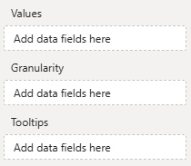
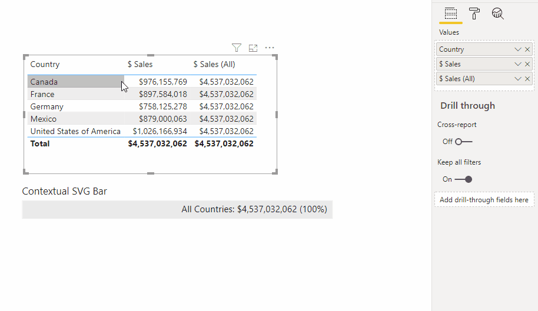
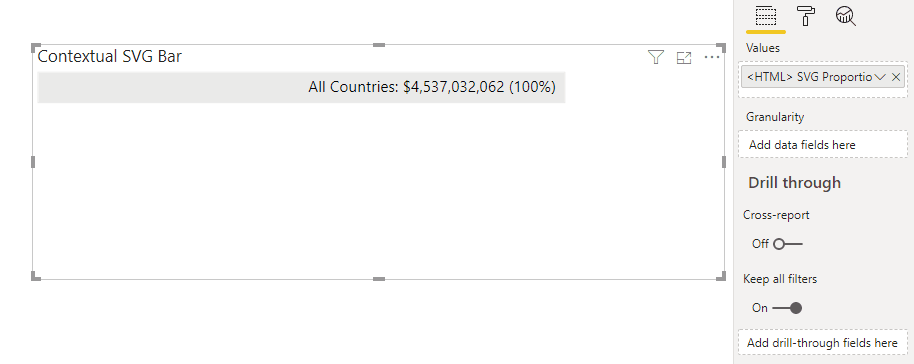

# Data Roles

HTML Content has 3 data roles ("fields", "buckets", "wells"...) that you can use to add columns or measures from your data model to affect the resulting output of the visual in your report:



## Values

The **Values** data role accepts either a column or measure that you wish to use to generate the visual's output.

If the column or measure contains valid HTML, then the visual will render this for you.

### Using Columns

If using a column, the visual will use all distinct values passed into its data view by Power BI. For example, the [column we use to create a country flag in our simple walkthrough](simple-example#making-the-country-flag), will generate row context for each value:


### Using Measures

If using a measure, the visual only has context for that particular value, e.g.:


You can introduce row context by either:

- Adding columns to the **Granularity** data role (detailed below) so that the measure evaluates as desired.

- Using table variables in your measure to create a result set that you can flatten down to a single, continuous value of HTML. The simple example [illustrates this concept](simple-example#option-2-encapsulate-data--content-within-measure) if you wish to explore further.

## Granularity

The **Granularity** data role is used to generate additional row context using one or many columns, without adding the value of those columns to the visual output.

This is useful if you want to add a single measure to the **Values** data role, but generate HTML for a specific level of granularity.

In the example above we started by adding the `[$ Sales]` measure to our visual and this results in a single value. But, let's say we want to create a measure that produces richer output based on `[$ Sales]` and a measure that includes all sales, e.g.:

```dax$
Sales (All) = CALCULATE(
    [$ Sales],
    ALL(Financials)
)
```

If we create a table and add the `[$ Sales]` and `[$ Sales (All)]` measure, we can see the effect this has on row context for each measure.

We could now create a measure that generates some SVG that will shade based on a proportion of sales vs `[$ Sales]` and `[$ Sales (All)]` and check the current context, e.g.:

```dax
<HTML> SVG Proportion of Sales =
    VAR ContainerWidth = 500
    VAR ContainerHeight = 30
    VAR SelectedCountry = SELECTEDVALUE ( Demographic[Country] )
    VAR CountryCaption = IF (
        SelectedCountry <> "", SelectedCountry,
        "All Countries"
    )
    VAR TotalSales = FORMAT ( [$ Sales], "$#,##0" )
    VAR SalesPercent = DIVIDE( [$ Sales], [$ Sales (All)] )
    VAR SalesPercentFormatted = FORMAT( SalesPercent, "#%")
    VAR SalesWidth = ContainerWidth * SalesPercent
    RETURN
        "<svg height='" & ContainerHeight
                & "' width='" & ContainerWidth
                & "' style='border: 1px solid #eaeaea'>
            <rect width='" & SalesWidth
                & "' height='" & ContainerHeight
                & "' style='fill: #eaeaea;'/>
            <text text-anchor='end' dominant-baseline='middle' x='"
                    & ContainerWidth - 10
                    & "' y='" & DIVIDE( ContainerHeight, 2 )
            & "'>"
                & CountryCaption & ": "
                    & TotalSales
                    & " (" & SalesPercentFormatted & ")"
            & "</text>
        </svg>"
```

If we add this measure, we get some context-awareness as we click on the table's rows to look at a specific country, e.g.:



Or, we could add the `[Country]` column to the **Granularity** data role and get one bar per row, without including that value in our output:



:::tip Granularity is as far as you want to go
Multiple columns can be added to **Granularity** if you want to further extend the row context to suit your use case.
:::

## Tooltips

The **Tooltips** Data role is intended to be used in conjunction with the Power BI Interactivity features, so it is best [you refer to that page](interactivity) for specific details on how to make the best use of it.
