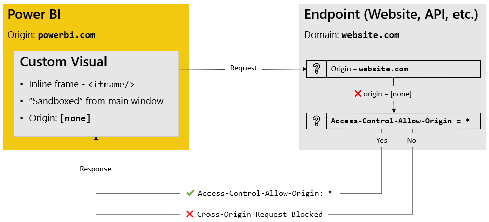

# Limitations

If you're serious about content, then it's recommended that you spend some time reading this page in detail to understand why the visual has challenges for some types of HTML or web-based content.

:::info A Very Quick Summary

- Microsoft hosts custom visuals in **[sandboxed iframes](https://www.w3schools.com/TAGS/att_iframe_sandbox.asp)** in order to keep a user safe from potentially malicious third-party code.
- It doesn't matter whether a custom visual is certified or uncertified when it comes to this limitation.
- Therefore some things that work in a standalone web browser or web application will nto work, no matter how hard you try, and we can't change this.

:::

## Choice of Visual Edition

In the regular edition, the visual is not certified and can handle more HTML use cases, but it does not receive certification benefits, such as export to PowerPoint or PDF. In **HTML Content (lite)**, the visual has these additional benefits, but in order to comply with certification rules, it can only handle simpler HTML use cases as the cost of more security for the report viewer.

Please refer to the [Visual Editions](visual-editions) page for more information on what HTML tags are permitted in the certified edition.

## Things "Protected" By Microsoft from Custom Visuals via Sandboxing

The visual can't handle some aspects of HTML, due to the sandboxing rules applied by Power BI's main window. [This is detailed below](#custom-visuals-high-level) if you wish to understand further, but if you're attempting any of the following, then you're probably out of luck:

- Some hyperlinks (although `http` and `https` are [supported via delegation to Power BI](properties-content-formatting#allow-opening-urls))

- `<iframe>` elements in Desktop - reports may need to be published to the Power BI Service to be tested/viewed.

- `<iframe>` elements that embed content from sites that block [cross origin resource sharing, or CORS (e.g. YouTube)](#cross-origin-resource-sharing-cors---regular-edition-only). We'll try and collect the ones we know to work [below](#embeddable-content-known-to-work---regular-edition-only).

- `<script>` tags referencing externally-hosted JavaScript.

- `<object>` tags.

- Modal windows or popups

- Cookies or local storage

:::tip There May Be Some that Work
If you find one that's not listed, [please let me know about it](https://github.com/dm-p/powerbi-visuals-html-content/issues) so I can investigate and update the documentation (or the visual, if it turns out to be a bug) accordingly.
:::

## Embeddable Content Known to Work - Regular Edition Only

Embedding content from any the following services is known to work once a report has been published in the Power BI Service:

| Who                            | Details                                                                                                             |
| ------------------------------ | ------------------------------------------------------------------------------------------------------------------- |
| [Vimeo](https://www.vimeo.com) | [Walkthrough instructions, courtesy of DiscoverEI](https://www.discoverei.com/blog/how-to-embed-videos-in-power-bi) |

If you know of any that do work, your knowledge can greatly assist other users. Please either [@ me](https://bsky.app/profile/dm-p.nz), or [create an issue](https://github.com/dm-p/powerbi-visuals-html-content/issues/new?assignees=&labels=documentation&template=embeddable-services.md&title=%5BEMBED%5D+Name+of+Service) to make me aware and I can add the details to the page. If you have an example or walkthrough you can provide, that's even better and I'll be happy to link to it so others can follow your lead.

## Custom Visuals: High-Level

All custom visuals are themselves hosted in an `<iframe/>` element that is [sandboxed](https://www.w3schools.com/tags/att_iframe_sandbox.asp) from the main Power BI application. The only permission they have enabled is `allow-scripts`.

- Because the `allow-same-origin` permission is disabled, another protection is that the visual does not belong to `powerbi.com` (a revocation of the `allow-same-origin` policy)

- Therefore, a visual cannot do things like query the data model of its own volition, using the same techniques Power BI uses to fetch data for visuals.

- This means that visuals can't just "reach in and grab" data from your model, and data can only be supplied to the visual from Power BI.

- According to [the MDN documentation](https://developer.mozilla.org/en-US/docs/Web/HTML/Element/iframe) on `<iframe/>`, having a combination of `allow-scripts` and `allow-same-origin` is not a good idea:

  > When the embedded document has the same origin as the embedding page, it is strongly discouraged to use both `allow-scripts` and `allow-same-origin`, as that lets the embedded document remove the `sandbox` attribute — making it no more secure than not using the `sandbox` attribute at all.

- Microsoft are unlikely to ever allow this to happen in the current visual architecture, as it can mean that visuals can potentially cause a whole heap of trouble (even if the author is well-intentioned).

## Cross Origin Resource Sharing (CORS) - Regular Edition Only

It's hard to explain why some things don't work when you try them without having to get a bit technical. [This article by MDN is really essential reading](https://developer.mozilla.org/en-US/docs/Web/HTTP/CORS) if you do any work within the web development space and/or want to include remote content in your Power BI report.

It's recommended that you do take some time to understand the concepts, but the salient points are these:

- When a custom visual makes a request to an external site, its origin does not match that of the site in question and will fail the `same-origin` policy check.

- If the external site is configured to allow requests from _any_ origin (`*`), it will give consent for the visual to access its resource. Otherwise, it will not be granted.

- If your content does not appear, the external site has most likely not allowed cross-origin requests from locations with an empty origin.

There's not much you can do about this, unless the website administrators are prepared to make changes to this policy from their end. Refer to the end of the above section as to why Microsoft are unlikely to change things from the Power BI-side of things.

## `iframe` Behavior - Regular Edition Only

`<iframe>` elements are used for a number of use cases where someone might wish to embed content from another site into a page.

These are permitted by the visual, but it's up to Power BI, and a combination of the destination website as to whether they get rendered.

- Power BI Desktop does not render `<iframe>` elements within any custom visuals.

- When you publish to the Power BI Service, it's possible thay _may_ work - `<iframes>` will work if the destination site sets `Access-Control-Allow-Origin: *` in their responses. Most sites disable this.

If your `<iframe>` doesn't work in the Power BI Service, it's due to the reasons outlined above.

To re-state, there's nothing we as visual authors, or you as a content creator can do to work-around this. If your destination website is willing to remove CORS restrictions from their end, then you should be good, but this is also an unlikely resolution.
