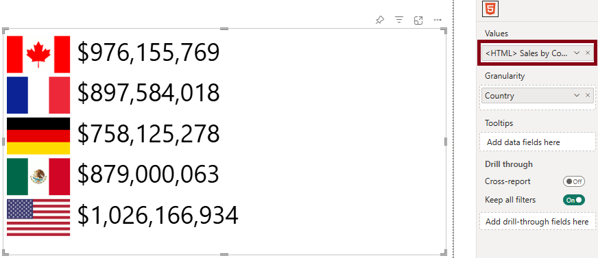
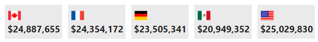

# Stylesheet

The **Stylesheet** property menu allows you to provide CSS at the top level, rather than having to manage styling in-line or contextually. You can do this either by using a measure (via conditional formatting), or providing a CSS definition manually.

If you're using [Granularity](data-roles#granularity) (which uses div elements to separate rows), then this allows you to do things like change the display behavior to create alternate layouts.

If we refer back to [our example from earlier](simple-example#option-1-create-context-using-granularity), this has one entry per value of **[Country]**, e.g.:



The body is contained in a `div` element with an `id` value of `htmlContent`. Each row in the visual dataset is contained within a `div` element with an assigned class name of `htmlViewerEntry`.

The CSS selectors for these elements are `#htmlContent` and `.htmlViewerEntry` respectively, and (as of 1.2) this can be confirmed by inspecting the raw HTML (using [Show Raw HTML](properties-content-formatting#show-raw-html) property).

For example, to change the flag layout to horizontal, and display a background, we could create a measure like the following:

```dax
<CSS> Horizontal Flag = "
    #htmlContent {
        width: 100%;
        display: flex;
        flex-direction: row;
        justify-content: center;
    }
    .htmlViewerEntry {
        width: 100px;
        margin: 5px;
        padding: 5px;
        background-color: #eaeaea;
    }"
```

...and add this to the stylesheet property in the properties pane using conditional formatting and achieve the following result:



If we use the **Show Raw HTML** property, the stylesheet and output are combined for debugging, or to copy/paste elsewhere, e.g.:

```html
<style id="visualUserStylesheet" name="visualUserStylesheet" type="text/css">
  #htmlContent {
    width: 100%;
    display: flex;
    flex-direction: row;
    justify-content: center;
  }

  .htmlViewerEntry {
    width: 100px;
    margin: 5px;
    padding: 5px;
    background-color: #eaeaea;
  }
</style>
<div id="htmlContent">
  <div class="htmlViewerEntry">
    <div>
      
      <b>$24,887,655</b>
    </div>
  </div>
  <div class="htmlViewerEntry">
    <div>
      
      <b>$24,354,172</b>
    </div>
  </div>
  <div class="htmlViewerEntry">
    <div>
      
      <b>$23,505,341</b>
    </div>
  </div>
  <div class="htmlViewerEntry">
    <div>
      
      <b>$20,949,352</b>
    </div>
  </div>
  <div class="htmlViewerEntry">
    <div>
      
      <b>$25,029,830</b>
    </div>
  </div>
</div>
```

:::info Stylesheet settings override simple content settings
If using the stylesheet property, the [styling options](properties-content-formatting#font-family) in the **Content formatting** menu are disabled and not applied to your output, so as to give you more explicit control and avoid potential conflicts that might be applied.
:::
