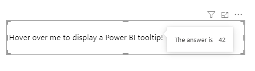

import ReactPlayer from "react-player";

# Interactivity

## A General Note About Power BI Interactivity

Before we begin, it might be worth talking a little bit about this, so that your expectations are managed. With interactivity, Power BI visuals depend very heavily on the row context of the dataset that is sent through. This is managed by Power BI and visuals don't have a lot of control over its behavior, so we have to work with what we've got. The challenges and limitations around this are <a href="https://deneb-viz.github.io/interactivity-overview" target="_blank">covered in pretty decent detail over on Deneb's website</a> if you want to understand this in a bit more detail, so we'll try to keep things brief here so that you can digest what you will and will not be able to do with these new features.

With HTML Content, we have what are likely two different camps of users:

1. Those who use the visual with its two main data roles: **Values** (for the HTML) and **Granularity** to create row context.
2. Those who use one giant measure to build their HTML.

For those who use the first approach, you will have the most options available to you. Using the **Granularity** data role creates row context that Power BI interactivity can understand. With the single measure, Power BI only has a single value as its context and this doesn't include things like row context. As such, you will be limited in what you can do, but we've tried to provide some help where we can (and will point this out below where it can benefit).

## Tooltips

Firstly, we have Power BI tooltip functionality. You have two approaches here:

### Standard Tooltip Binding

This approach is like for other visuals in Power BI and relies on having suitable row context. As such, if you use a single measure for your HTML output, then you will only be able to display a single tooltip for your visual, unless you use [Independent Tooltip Binding](#independent-tooltip-binding).

The simplest approach is to add measures to the new **Tooltip** data role, and HTML Content will display these when you hover over the element that represents your data row. If you add **Granularity** and have a suitable drillthrough page assigned (or a tooltip page), then this will work as you might expect, e.g.:

<ReactPlayer
  url={
    require("@site/docs/resources/mp4/interactivity/html-content-standard-tooltip-binding.mp4")
      .default
  }
  width="100%"
  height="100%"
  controls={true}
/>

#### Data Row Element Hover State

Additionally, when a data row element is hovered over with the mouse, HTML Content will apply a class of **`hover`** to it. You can apply a suitable selector to the stylesheet measure to apply styling on these events. Note that using the **`:hover`** [pseudo class](https://developer.mozilla.org/en-US/docs/Web/CSS/Pseudo-classes) will work as well:

<ReactPlayer
  url={
    require("@site/docs/resources/mp4/interactivity/html-content-data-row-element-hover-state.mp4")
      .default
  }
  width="100%"
  height="100%"
  controls={true}
/>

### Independent Tooltip Binding

If you prefer to use a single measure, you may not benefit from some of the above enhancements, particularly as report page tooltips rely on row context to display them for the user. However, if you are building the ultimate visual purely from HTML and a single measure, there is some help at hand: you can specify elements in your design that should trigger standard Power BI tooltips, and bind data elements to them to display. This is leveraged with a reserved class and [data attributes](https://developer.mozilla.org/en-US/docs/Learn/HTML/Howto/Use_data_attributes).

- Firstly, add the **`tooltipEnabled`** class to the element(s) that you wish to trigger a tooltip. This will instruct HTML Content to bind an event listener to that element.

- Next add **2** **`data-tooltip-*`** attributes for each item you wish to display in the tooltip - one for the **`title`** of the field, and one for the field **`value`**. These should each include a suffix that represents a unique key for that tooltip item (and will be used to reconcile both data attributes).

For example, this might look like the following in raw HTML:

```html
<p
  class="tooltipEnabled"
  data-tooltip-title-00="The answer is"
  data-tooltip-value-00="42"
>
  Hover over me to display a Power BI tooltip!
</p>
```



The video below shows an overview of how this works in practice:

<ReactPlayer
  url={
    require("@site/docs/resources/mp4/interactivity/html-content-independent-tooltip-example.mp4")
      .default
  }
  width="100%"
  height="100%"
  controls={true}
/>

The reason for two attributes per field is because we can't use semantic naming for a data attribute (such as including spaces). To provide the most flexibility for your displayed title, having a dedicated attribute allows you to be more specific with your user-facing content.

Similarly, you don't need to suffix the key with a hyphen or a number; you just need the prefix to be correct and that the suffix you use:

- Creates a valid HTML data attribute.
- Results in the same matching key across both attributes that you need.

You _can_ also omit the title or the value if you wish to only fill one of these field properties out, but usually tooltips only provide valid insight with both attributes.

## Cross-Filtering

If you use the **Granularity** data role, this can now provide you with the ability to cross-filter other visuals. Unfortunately, single-measure designs cannot benefit from this due to no row context being present in the visual dataset.

For those who wish to use this feature, you will need to have at least one column in the **Granularity** data role and **Enable** the functionality, e.g.:

<ReactPlayer
  url={
    require("@site/docs/resources/mp4/interactivity/html-content-cross-filtering-overview.mp4")
      .default
  }
  width="100%"
  height="100%"
  controls={true}
/>

### Unselected Data Point Appearance and Manual Styling

By default, unselected data points will be dimmed as for how other visuals typically do it, i.e. 70% transparency. You can modify this value in the **Transparency %** property if you wish for the effect to be accentuated or reduced accordingly.

Much like the tooltip hover event, the enclosing HTML element for unselected data points has a class of **`unselected`** applied to it, and you can apply your own styling. If you wish to do this, it's recommended that you disable the **Set transparency of unselected items** property.

<ReactPlayer
  url={
    require("@site/docs/resources/mp4/interactivity/html-content-unselected-data-point-appearance.mp4")
      .default
  }
  width="100%"
  height="100%"
  controls={true}
/>

## Context Menu

If you have columns in the **Granularity** data role (creating valid row context), the context menu will now offer data point-related options, including drillthrough, if you have a valid page to do so, e.g.:

<ReactPlayer
  url={
    require("@site/docs/resources/mp4/interactivity/html-content-context-menu-granularity.mp4")
      .default
  }
  width="100%"
  height="100%"
  controls={true}
/>
