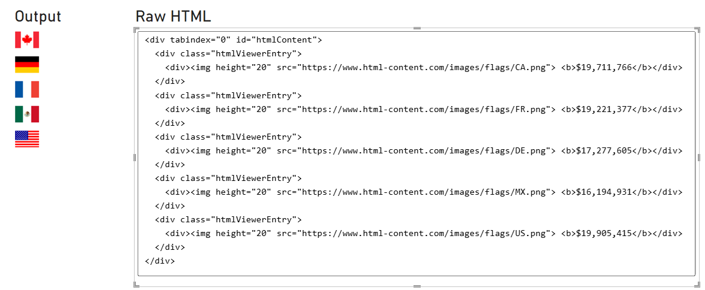
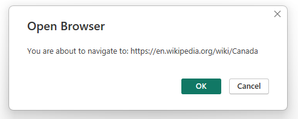
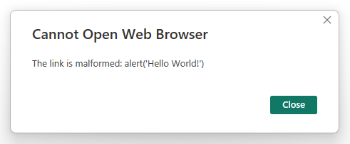
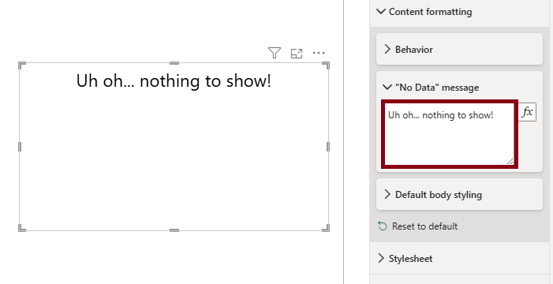
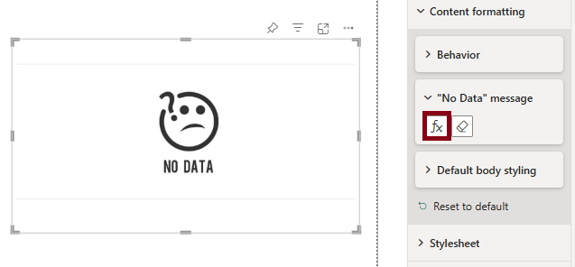

# Content Formatting

The **Content formatting** property menu can be used to manage some aspects of the visual's appearance to the end-user.

## Behavior

### Show raw HTML

By default, the visual will attempt to render any content in the **Values** data role. However, if you want to check the generated HTML, you can enable this to confirm everything is as intended, e.g.:



- This area is scrollable, and it is possible to select text and copy to the clipboard with **Ctrl + C** (or your system's assigned shortcut).
- The raw HTML will also include the `<div/>` used to encapsulate all body content, and the `<div/>` used to encapsulate individual rows from the visual dataset, which may also help with identifying how the DOM is structured, and for identifying CSS selectors for standard elements.
- If a stylesheet has been assigned via visual properties, the resolved CSS will also be included in a `<style/>` tag.

### Allow opening URLs

Custom visuals are prevented from directly opening hyperlinks or external URLs on behalf of the user, as this is potentially malicious behavior if done without any visible effect. However, custom visuals can request that Power BI open a URL on their behalf.

- Enabling the **Allow Opening URLs** property will delegate the request to open the hyperlink to Power BI. If permitted, this will prompt the user for their consent to navigate to this URL, e.g.:

  

- Only `http://` and `https://` protocols are supported for custom visuals. This means that other protocols, such as `javascript:`, `ftp://`, `mailto:`, `file://` will result in an error, e.g.:

  

### Allow text select

While Power BI has a **Copy** option in the context menu, this only applies to the entire visual and not specific content within it. Therefore you can enable this option to allow users to highlight text using their mouse.

Highlighted text can be copied to the clipboard with **Ctrl + C** (or system equivalent).

## "No Data" message

In the event of no data being returned, you can use this property property to customize what's displayed to your users, e.g.:



The property has also been enabled to make use of conditional formatting. If you so wish, you could use a measure containing HTML-based formatting instead, e.g.:

```dax
<HTML> No Data = "
    <hr/>
    
    <hr/>"
```



If you want to apply styling to this element, it is rendered as a child `<div/>` of the `#statusMessage` element in the DOM.

## Default body styling

### Font family

This property will apply the specified `font-family` to the visual's body, if there is no overriding styling applied to the HTML content - either in an an element's inline `style` attribute, or in a `<style>` tag if using one of those in your expressions.

### Font size

This property will apply the specified `font-size` to the visual's body, if there is no overriding styling applied to the HTML content - either in an an element's inline `style` attribute, or in a `<style>` tag if using one of those in your expressions.

### Font color

This property will apply the specified `color` to the visual's body, if there is no overriding styling applied to the HTML content - either in an an element's inline `style` attribute, or in a `<style>` tag if using one of those in your expressions.

### Text alignment

This property will apply the specified `text-align` to the visual's body, if there is no overriding styling applied to the HTML content - either in an an element's inline `style` attribute, or in a `<style>` tag if using one of those in your expressions.
